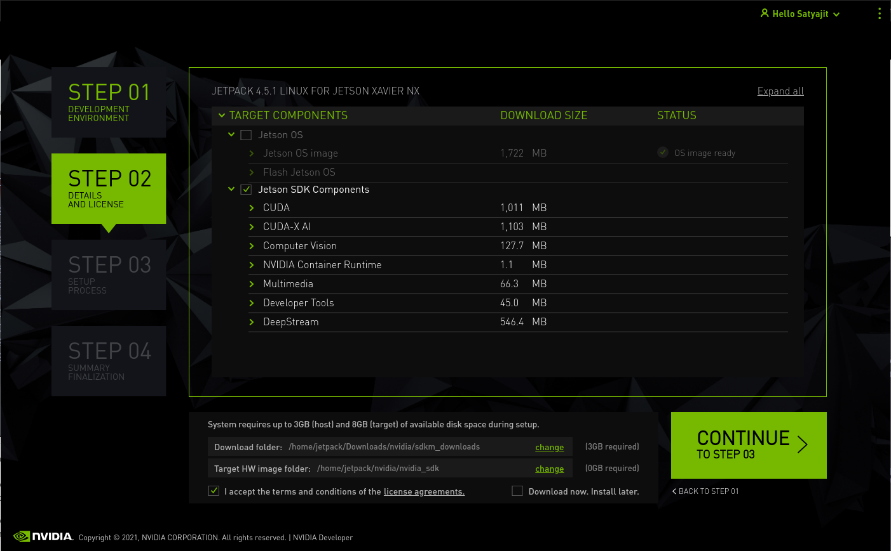
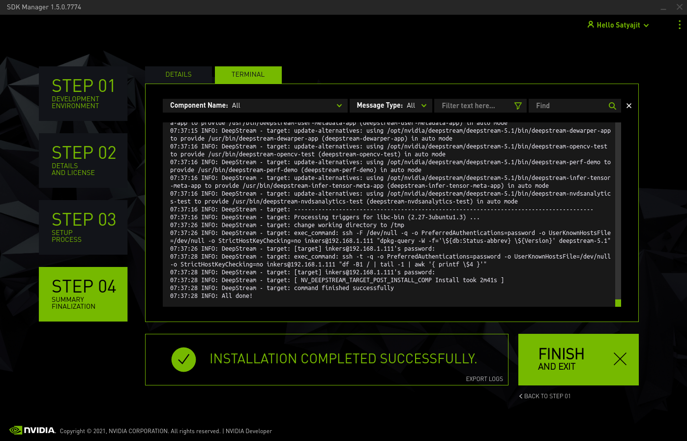

title: Setup Xavier NX Board w/ NVMe 
date: 2021-05-07 19:30
modified: 2021-05-07 19:30
category: tutorial
tags: nvidia, jetson, xavier nx, vscode, linux
slug: setup-xavier-nx 
author: satyajit-ghana
summary: Setting up Xavier was a pain, partially because i wasn't aware of how to use Nvidia SDK Manager and partially because i am not good arm64 devices, like setting them up

# Setting Up / Reset / Upgrade Nvidia Jetson Xavier NX

Did you know that Xavier NX can come it different flavours, some with 4xUSB3.0, some with 2xUSB3.0 + 2xUSB2.0, some with only 1xUSB3.0 + 1xUSB2.0, some with NVMe storage attached along with eMMC memory, but no sd card !!? and some with no NVMe but with only a sd card and eMMC memory ?

Resetting/Setting Up/Upgrading so many differnent variants is so damn frustrating ! Also using them is frustrating, i wish there was a standard procedure for it, or is it there already?

I wanted to update the Jetpack on my Xavier NX from 4.4 to 4.5, and it was a nightmare

1. Updating JetPack all from command line

```
sudo apt update
sudo apt upgrade
```

Now you need to modify the apt source list to point to the latest release

```
sudo vim etc/apt/sources.list.d/nvidia-l4t-apt-source.list
```

Change the repository name and download URL in the deb commands.

The original commands are:

```
deb https://repo.download.nvidia.com/jetson/common <release> main
deb https://repo.download.nvidia.com/jetson/<platform> <release> main
```

`<release>` is the release number of the minor release you want to upgrade to. For example, to upgrade to minor release 32.2, replace r32 with r32.2. OTA upgrades to the latest point release of the specified minor release (r32.2.1 in this case).

So i did that, and on first look that worked !! but there was a huge issue, i connected my camera, and it wasn't recognised, so in frustration i uninstalled docker, and wtf, i couldn't install it back on, and this is how i f'ed up.

2. Updating using SDK Manager

So now what? i decided to boot to recovery mode and reflash it. The board is from Mistral, couldn't find any documentation on how to go to recovery mode using jumper pins.

Here's how you would do it using jumper pins: [https://www.stereolabs.com/blog/getting-started-with-jetson-xavier-nx/](https://www.stereolabs.com/blog/getting-started-with-jetson-xavier-nx/)

But if you are booted into a OS, you can use this to boot to recovery

```
sudo reboot --force forced-recovery
```

Oh damn, and this command worked!, like finally

So now you can use the SDK Manager to flash it !!!

Well . . . another issue now, SDK Manager only works on Ubuntu 18.04 and i happen to be running Ubuntu 21.04 :(( , so instead i thought, why not use a docker image for SDK Manager?

Here it is

```
https://github.com/satyajitghana/sdk_manager_docker
```

Also make sure the USB wire is a good one, otherwise it wont be detected on your PC, as soon as you connect, the file manager should pick up the device as a mount. Also `lsusb` should show the Nvidia Device.

So simply use that and voila, you can now flash the device

Although it wasn't that easy eh, I had no clue what QEMU was, and that i was missing it!, simply setting up QEMU for arm64 fixed it.

> When used as a machine emulator, QEMU can run OSes and programs made for one machine (e.g. an ARM board) on a different machine (e.g. your own PC). By using dynamic translation, it achieves very good performance.

So what SDK Manger does is builds all the packages on the host machine if needed and cross-compiles it for the ARM board, and installs it via USB

So fire up sdk manager from docker, connect your xavier nx, and select the type of board, basically dev kit is nvidia's original kit, and the other one is vendor versions of the xavier.

If you don't want to install stuff in your host machine (i.e. docker) then dont select host machine in sdk manager

Also the Jerson SDK Components will be installed via Network SSH, and the Jetson OS will be installed via USB, so no need to install all of them at once, i did it in two chunks, flash the OS first, and then install the components.

Also because all of these components will NOT install in 15GB eMMC memory, and it will run out of space.



Here's the terminal




> After flashing the latest JetPack, DO NOT INSTALL ANYTHING ON YOUR OWN, NOT UNLESS YOU INSTALL ALL THOSE SDK COMPONENTS FROM NVIDIA. IT WILL BREAK YOUR INSTALLATION

But before installing the SDK Components you can mount the root on your ssd, format it before if needed, using "Disks" Program (GNOME Disk Utility)

```
$ git clone https://github.com/jetsonhacks/rootOnNVMe
$ cd rootOnNVMe
$ sudo ./copy-rootfs-ssd.sh
$ sudo ./setup-service.sh
```

After flashing my Jetson 3-4 times i realsed this. After installing the OS, i used to install NoMachine (its like VNC), and the SDK Components would NOT INSTALL.

This was because nomachine was installing some dependencies, which nvidia's components dont't like.

> SO FIRST INSTALL ALL THOSE SDK COMPONENTS, VERY IMPORTANT, BEFORE INSTALLING ANYTHING ON YOUR OWN

When i had got this board, we had nothing installed, and everything was build from source and installed, and damn that was suchhh as pain, especially OpenCV.

But the SDK Manager makes it really easy, Opencv 4+ installed quite easily ! :)

Love the SDK Manager

## Some useful links

- [https://forums.developer.nvidia.com/t/system-throttled-due-to-over-current/167029/59](https://forums.developer.nvidia.com/t/system-throttled-due-to-over-current/167029/59)

- [https://www.jetsonhacks.com/2020/05/29/jetson-xavier-nx-run-from-ssd/](https://www.jetsonhacks.com/2020/05/29/jetson-xavier-nx-run-from-ssd/)

- [https://forums.developer.nvidia.com/t/recovery-interface/146709/3](https://forums.developer.nvidia.com/t/recovery-interface/146709/3)

- [https://github.com/atinfinity/sdk_manager_docker/issues/6](https://github.com/atinfinity/sdk_manager_docker/issues/6)

- [https://docs.nvidia.com/jetson/l4t/index.html#page/Tegra%20Linux%20Driver%20Package%20Development%20Guide/updating_jetson_and_host.html](https://docs.nvidia.com/jetson/l4t/index.html#page/Tegra%20Linux%20Driver%20Package%20Development%20Guide/updating_jetson_and_host.html)

- [https://developer.nvidia.com/nvidia-sdk-manager](https://developer.nvidia.com/nvidia-sdk-manager)
